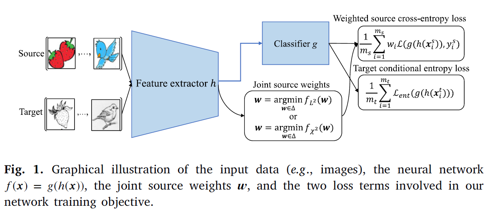

# Joint-Weight-Optimation (JWO)



This repository provides the Pytorch codes for the work "Joint Weight Optimization for Partial Domain Adaptation via Kernel Statistical Distance Estimation" published in Neural Networks, 2024. The video for introducing this work will soon be available at the Bilibili platform. Fig. 1 illustrates the main idea of this work. 

Briefly speaking, this work develops a fundamental technique to estimate the statistical distance between the weighted source joint distribution and the target joint distribution from samples. The estimated statistical distance is expressed as a function of the source sample weights, such that the weights can be optimized to minimize the statistical distance and align the joint distributions for the partial domain adaptation problem. 

This repository provides two versions of Pytorch codes. One is with the shallow network model and the pre-extracted deep learning features. Users can run it with the Jupyter notebook "A Quick Demo for the JWO Algorithm.ipynb" and the folder "OfficeHome" (remember to unzip the datasets in the folder). The other is with the deep ResNet50 model and the raw images. See below for instructions on how to run the code.

#### Dataset folder
The folder structure required (e.g OfficeHome)
- data
  - OfficeHome
    - list
      - Art_25.txt
      - Art.txt
      - Clipart_25.txt
      - Clipart.txt
      - Product_25.txt
      - Product.txt
      - RealWorld_25.txt
      - RealWorld.txt
    - Art
    - Clipart
    - Product
    - RealWorld

##### How to run

```bash
python demo.py  --gpu 0   --root_dir ./data/OfficeHome --dataset OfficeHome --distance Chi2  --source Art --target Clipart --seed 0 | tee PDA-OfficeHome_A2C_Chi2_seed0.log

python demo.py  --gpu 0   --root_dir ./data/OfficeHome --dataset OfficeHome --distance L2  --source Art --target Clipart --seed 0 | tee PDA-OfficeHome_A2C_L2_seed0.log
```

For the details of this work,  please refer to the paper below: 

@article{Chen2024Joint,  
  author={Sentao Chen},  
  journal={Neural Networks},   
  title={Joint Weight Optimization for Partial Domain Adaptation via Kernel Statistical Distance Estimation},   
  year={2024},      
  volume = {180},      
  pages = {106739},     
  issn = {0893-6080},       
  doi = {https://doi.org/10.1016/j.neunet.2024.106739}     
  }

The Pytorch code is currently maintained by Lisheng Wen. If you have any questions regarding the code, please contact Lisheng Wen via the email lishengwenmail@126.com.
